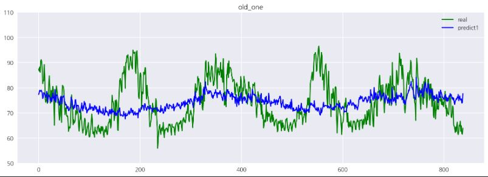

# Regression_Project

## 계절성을 고려한 제주도 전력 예측

### 주제 선정 배경

1. 전력수요 예측은 전력 공급정책의 기초자료중 하나. 전력수요 예측은 에너지 분야 최상위 행정계획인 에너지기본계획에 영향을 미침.\
관련기사
http://www.headlinejeju.co.kr/news/articleView.html?idxno=417262
"제주도 6차 지역에너지계획, 전력설비, 풍력발전 공급과잉" - 2020년 5월 기사

2. 제주도 전력수요 예측의 실패 현황\
관련 기사\
"올 여름 제주지역 최대 전력수요 예측량도 빗나갔다" -2013년 기사\
http://www.jejusori.net/news/articleView.html?idxno=132579\
"제주 최대 전력수요 빗나가.. 10% 증가 법칙도 깨져" "101만 5000kW 까지 치솟을 것으로 전망했지만, 6만 6000kW를 밑돌아" - 2018년 8월 기사\
http://www.jejusori.net/news/articleView.html?idxno=209324\

3. 제주도 관광객 유입에 따른 전력수요 증가\
관련기사\
"여름 휴가시즌을 맞아 제주관광이 최성수기를 맞아 전력이 풀가동.." - 2019년 8월 기사\
http://www.headlinejeju.co.kr/news/articleView.html?idxno=369648\

### 데이터 출처
1. 기상/전력 데이터\
https://dacon.io/competitions/official/235606/overview/ (데이콘)

2. 관광객 데이터\
http://www.visitjeju.or.kr/web/bbs/bbsList.do?bbsId=TOURSTAT (제주도 관광협회)

3. 제주도 인구 데이터\
https://www.jeju.go.kr/open/stats/news/trend.htm?act=view&seq=1162310&page=9 (제주도청)

4. 불쾌지수 데이터(위키백과- 불쾌지수 계산식 활용)\
(0.81 * 섭씨온도 +0.01 * 상대습도(%)（0.99*섭씨온도 - 14.3）+ 46.3)

5. 체감온도 - 제주 기상청\
수집 기간 : 2018.02.01 ~ 2020.05.18

### Features

### Regression 결과
- 기존의 선형회귀 방법\

- 우리가 제시한 방법\

